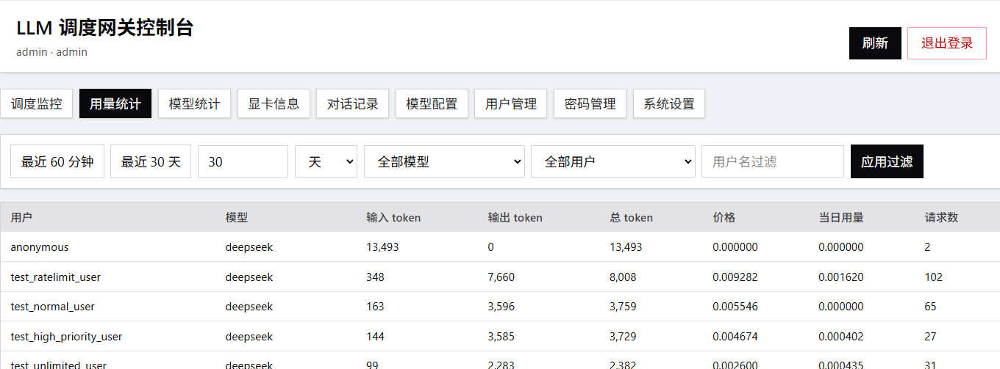

# LLM 调度网关

基于 FastAPI + Next.js 的大模型推理调度网关，提供优先级队列调度、限速、降质、用量统计等功能。

## 界面预览



## 许可证声明

本项目采用 [Apache License 2.0](https://www.apache.org/licenses/LICENSE-2.0)。

在遵守许可证条款的前提下，您可以使用、复制、修改、合并、发布、分发以及商业化使用本项目。
Apache 2.0 还包含贡献者专利授权：当您遵守许可证条款时，贡献者会向您授予其必要专利的使用许可。
该许可证不授予商标权，也不提供任何明示或默示担保。

如需对外重新分发，请保留原始版权声明和许可证文本。

## 核心功能

- **高低优先级分级调度** — 请求按优先级（1-5）进入队列，高优先级优先处理，支持配置高低优先级处理比例
- **窗口内自动限速** — 统计窗口内请求次数或消费额度超阈值时，自动降低用户优先级或拒绝请求
- **每日额度限速** — 用户当日消费超过额度上限时触发限速或拒绝
- **超额自动降质** — 超额用户的请求自动转发到配置的降质模型（如从商业 API 切换到本地模型）
- **Token 与请求数统计** — 记录每次请求的 prompt/completion token 数和费用，支持按用户、模型、时间维度查询
- **对话记录日志** — 保存用户提问和模型回复内容，支持检索和审计
- **多模型负载均衡** — 单个模型名可配置多个后端队列，按 load_factor 分配请求
- **显卡使用监控** — 实时采集多台服务器 GPU 显存使用率，前端可视化展示
- **灵活注册方式** — 支持 IP 自动注册（免密钥）或 API Key 注册两种模式，可动态切换

## 项目结构

```
LLM_Scheduling/
├── backend/                  # 后端服务
│   ├── llm-gateway-main.py   # FastAPI 主服务（API + 管理接口）
│   ├── llm-gateway-scheduler.py  # 调度器（从队列取请求转发到模型）
│   ├── queue_middleware.py    # 队列中间件（请求入队）
│   ├── auth_module.py         # 认证与限速
│   ├── db_module.py           # 数据库操作（PostgreSQL）
│   ├── runtime_config.py      # 动态配置管理
│   ├── runtime_config.json.example  # 运行时配置样例
│   ├── config.py              # 静态配置（环境变量）
│   ├── token_counter.py       # Token 计数
│   ├── usage_module.py        # 用量计费
│   ├── response_utils.py      # 响应处理工具
│   ├── requirements.txt       # Python 依赖
│   └── gpu-data/              # GPU 监控模块
├── frontend/                  # Next.js 前端
│   ├── src/app/page.tsx       # 管理面板主页
│   ├── src/app/login/         # 登录页
│   └── .env.local             # 前端环境变量
├── nginx.conf                 # Nginx 配置参考
└── docs/                      # 文档
```

## 部署指南

### 环境要求

- Python 3.10+
- Node.js 18+
- PostgreSQL 14+
- Redis 6+

### 后端部署

1. 安装依赖：

```bash
cd backend
pip install -r requirements.txt
```

2. 配置环境变量（或使用默认值）：

```bash
# PostgreSQL
export POSTGRES_HOST=localhost
export POSTGRES_PORT=5432
export POSTGRES_DB=llm_data
export POSTGRES_USER=llm_user
export POSTGRES_PASSWORD=llm_password

# Redis
export REDIS_HOST=localhost
export REDIS_PORT=16379

# 初始管理员
export INITIAL_ADMIN_USERNAME=admin
export INITIAL_ADMIN_API_KEY=your-api-key
export INITIAL_ADMIN_PASSWORD=your-password
```

3. 复制 `runtime_config.json.example` 为 `runtime_config.json` 后配置模型：

```json
{
  "models": {
    "your-model": {
      "enabled": true,
      "api_url": "http://your-model-server:8000",
      "model_name": "actual-model-name",
      "queue_name": "your-model-queue",
      "api_key": "",
      "tokenizer_model": "gpt-3.5-turbo",
      "price": {
        "input_per_1k": 0.001,
        "output_per_1k": 0.001,
        "currency": "CNY"
      }
    }
  }
}
```

4. 启动服务：

```bash
# 启动网关主服务（默认端口 7103）
python llm-gateway-main.py

# 启动调度器（每个模型队列需要一个调度器实例）
python llm-gateway-scheduler.py
```

### 前端部署

1. 安装依赖：

```bash
cd frontend
npm install
```

2. 配置环境变量 `.env.local`：

```bash
NEXT_PUBLIC_API_BASE_URL=http://localhost:7103
NEXT_PUBLIC_ADMIN_CONTACT=管理员姓名
```

3. 开发模式：

```bash
npm run dev
```

4. 生产部署：

```bash
npm run build
npm run start
# 或导出静态文件配合 Nginx
npx next export
```

## API 使用

网关兼容 OpenAI API 格式，客户端只需将 base_url 指向网关地址：

```python
from openai import OpenAI

client = OpenAI(
    base_url="http://gateway-host:7103/v1",
    api_key="your-api-key"
)

response = client.chat.completions.create(
    model="your-model",
    messages=[{"role": "user", "content": "hello"}]
)
```

## 用户认证

- **登录方式**：用户名 + 密码（bcrypt 加盐哈希存储）
- **API 调用**：使用 API Key 通过 Bearer Token 鉴权
- **默认管理员**：用户名 `admin`，密码见环境变量 `INITIAL_ADMIN_PASSWORD`
- **新用户默认密码**：`123456`，首次登录后建议修改

## 配置说明

`runtime_config.json` 支持热更新，修改后网关和调度器自动加载，无需重启。
backend/config.py 修改这个文件的redis和数据库配置就行
